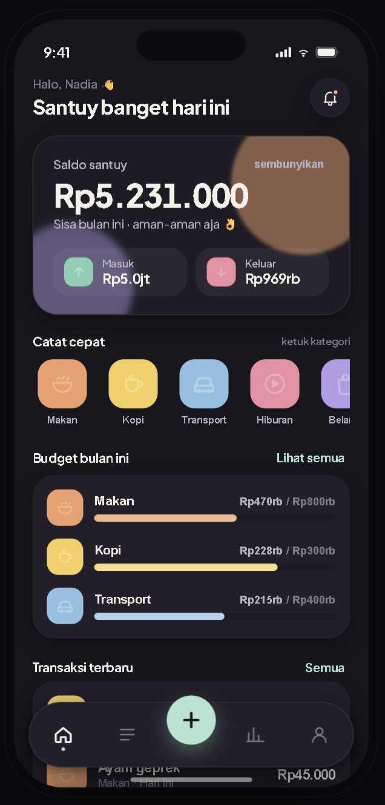

# Dompet Santuy 👛

Aplikasi catatan keuangan pribadi yang simpel, santuy, dan tetap informatif. Dibangun dengan Flutter untuk pengalaman yang mulus di Android dan iOS.

---

## Fitur Utama

- **Dashboard Santuy** — Lihat saldo, pemasukan, dan pengeluaran bulan ini dalam satu layar
- **Catat Cepat** — Catat transaksi langsung lewat kategori favorit (Makan, Kopi, Transport, dll.)
- **Budget per Kategori** — Pantau anggaran bulanan agar pengeluaran tetap terkendali
- **Riwayat Transaksi** — Semua catatan tersimpan rapi dan mudah dicari
- **Sembunyikan Saldo** — Privasi terjaga saat di tempat umum
- **Tampilan Gelap** — Dark mode sebagai default, nyaman di mata kapan saja

---

## Screenshot

<p align="center">
  
</p>

---

## Teknologi

| Stack | Detail |
|---|---|
| Framework | Flutter 3.x |
| Language | Dart |
| Font | Google Fonts |
| Platform | Android & iOS |

---

## Memulai

### Prasyarat

- Flutter SDK `^3.10.7`
- Dart SDK (sudah termasuk dalam Flutter)
- Android Studio / VS Code

### Instalasi

```bash
# Clone repositori
git clone https://github.com/anttonijulio/dompet_santuy.git
cd dompet_santuy

# Install dependensi
flutter pub get

# Jalankan aplikasi
flutter run
```

---

## Struktur Proyek

```
lib/
├── main.dart          # Entry point aplikasi
├── screens/           # Halaman-halaman utama
├── widgets/           # Komponen UI yang dapat digunakan ulang
├── models/            # Model data (transaksi, kategori, budget)
└── utils/             # Helper dan konstanta
```

---

## Lisensi

Proyek ini dibuat untuk keperluan pribadi. Feel free to fork dan kembangkan sendiri.

---

> *"Keuangan santuy, hidup tenang."* 🤙
